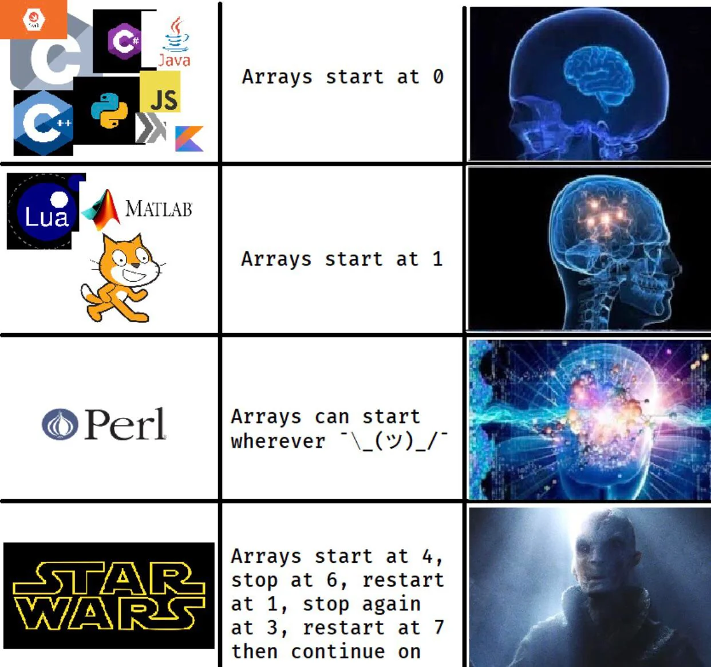

[](https://classroom.github.com/a/QznZQb1g)
[](https://classroom.github.com/open-in-codespaces?assignment_repo_id=13141866)
# C++ Arrays



## Description

This assignment is designed to help you understand the basics of arrays in C++.

## Objectives

- To gain experience with arrays in C++
- To be able to use arrays within functions to solve a problem.

**Note:** All arrays in this assignment will be one-dimensional arrays. If you are passing and array through a function, remember that arrays are by default passed by reference. This means that any changes you make to the array within the function will be reflected in the array outside of the function.

## Program 1: Uppercase Letters

Write a program that reads a string from the user and prints it out in all uppercase letters. You must use an array to store the string. You may not use any string functions to do this. You must write your own code to convert the string to uppercase.

Make the array a character array.

## Program 2: Answer Key

Mrs. Notestine needs help in grading a True/False test. The students' IDs and test asnwers are stored in a file. The first entry in the file is the answer key. Each subsequent entry in the file is a student's ID followed by their answers. For example,

```text
ABCD54301 TFTFTFTT TFTFTFFTTTFT 
```

The student ID is `ABCD54301` and their answer to question 1 is True, their answer to question 2 is False, etc. The student did not answer question 9. The exam has 20 questions and the class has more than 150 students.

Each correct answer is worth 2 points. Each wrong answer is worth -1 point. Each question left blank is worth 0 points.

Write a program to process the data. The output from the program should be the student's ID, their answers, followed then by their test score and then their grade. For example,

```text
ABCD54301 TFTFTFTT TFTFTFFTTTFT 25 F
```

Assume the following grade scale:

- A: 90-100
- B: 80-89.99
- C: 70-79.99
- D: 60-69.99
- F: 0-59.99

## Submission

You'll be submitting your assignment via GitHub Classroom. Make sure you've committed and pushed your local changes to your remote repo before the deadline. You must have ***AT LEAST 3 COMMITS*** when you submit your assignment.
