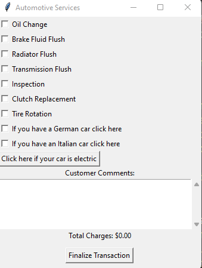
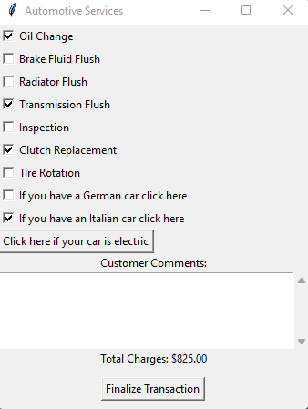
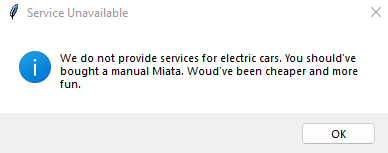
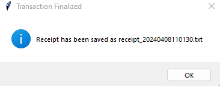

# Making an App for a Mechanic Shop


## Objective:

Develop a Python-based GUI application using the Tkinter library that simulates an automotive service billing system. This application will allow users to select automotive maintenance services, specify their car type, leave comments, and finalize their selections to generate a detailed bill, which includes the selected services, total cost, applicable tax, and final total with tax. Additionally, users will be informed if the selected service is not available for electric cars.

## Detailed Requirements:

1. **GUI Layout and Design**:
   - Utilize the Tkinter library to create a user-friendly interface for Joe's Automotive Services.
   - The main window should have a clear title indicative of the application’s purpose.

2. **Service Selection**:
   - Implement checkboxes for the following services with their respective base costs:
     - Oil Change ($30.00), Lube Job ($20.00), Radiator Flush ($40.00), Transmission Flush ($100.00), Inspection ($35.00), Muffler Replacement ($200.00), Tire Rotation ($20.00).
   - Allow users to select one or multiple services.
   - Dynamically update the total cost based on selected services.

3. **Car Type Adjustment**:
   - Provide options for users to specify if their car is either German or Italian, which affects the service costs due to the complexity and parts required:
     - German cars increase the base price by 75%.
     - Italian cars increase the base price by 150%.
   - Ensure that selecting one of these options automatically deselects the other (mutual exclusivity).

4. **Handling Electric Cars**:
   - Include a button labeled "Click here if your car is electric". When clicked, display a message stating that electric car services are not available.

5. **Customer Comments**:
   - Incorporate a text box where users can leave comments regarding their service needs or experience. This information should be included in the final bill.

6. **Finalizing Transaction and Generating Receipt**:
   - Implement a "Finalize Transaction" button. Upon clicking:
     - Calculate the total cost including a 7% tax.
     - Generate a receipt that includes the selected services, total cost, tax, final total with tax, and any customer comments.
     - Save the receipt to a text file named with a timestamp.
     - Notify the user of the receipt's filename and save location.

7. **Technical Specifications**:
   - Use the `datetime` module for timestamp generation.
   - Ensure mutual exclusivity logic is implemented correctly for car type selections.
   - Apply best practices for GUI layout, including sensible widget alignment and spacing.

## Example Program Output:

The following screenshots illustrate the expected functionality and design of the application:

1. Initial Application Window:
   
2. Service Selection and Cost Update:
   
3. Electric Car Service Unavailability:
   
4. Finalizing Transaction and Receipt Generation:
   
5. Receipt File Content:

```txt
Automotive Receipt
    Selected Services and Total:
 Total Charges: $157.50

 Tax: $11.03
 Total with Tax: $168.53

 Customer Comments:
 Car makes a funny noise
 
```
