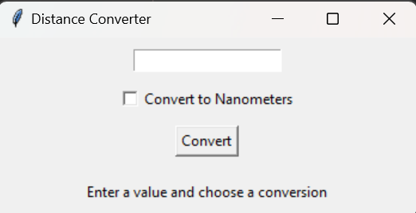
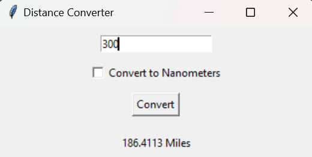
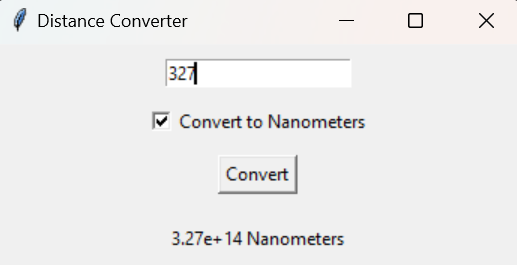
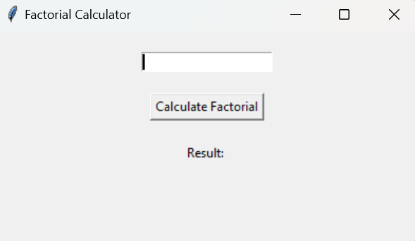
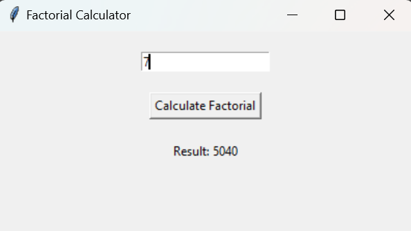
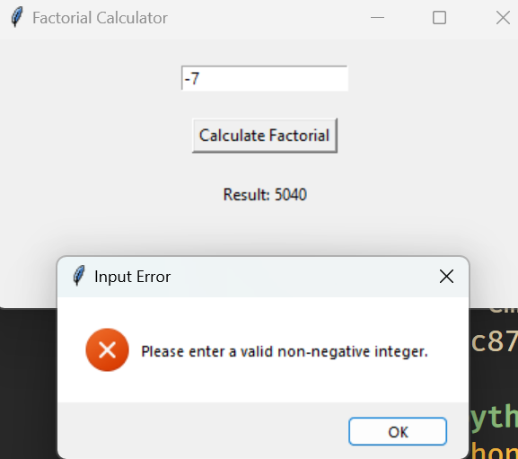

[](https://classroom.github.com/a/n9rBxaQh)
# Intro to GUI's in Python with `tkinter`


## What is a GUI?

A GUI (Graphical User Interface) is a type of user interface that allows users to interact with electronic devices through graphical icons and visual indicators, as opposed to text-based interfaces, typed command labels or text navigation. GUIs were introduced in reaction to the perceived steep learning curve of command-line interfaces (CLIs), which require commands to be typed on the keyboard. (Some will interpret themselves as Gigachads for only using command-line interfaces, but that's a discussion for another day.)

## Why use a GUI?

GUIs are generally easier to use than CLIs, as they allow users to interact with the program in a more intuitive way. This is especially true for users who are not familiar with the program or the command-line interface. GUIs can also make a program more visually appealing, which can help to attract users and make the program more user-friendly.

Think about previous programs you have made in this class. How much easier would it have been to interact with them if they had a GUI?

## What is `tkinter`?

`tkinter` is a built-in Python library that allows you to create GUI applications. It provides a set of tools and widgets that you can use to create windows, buttons, labels, text boxes, and other elements of a GUI. `tkinter` is easy to use and is a good choice for beginners who want to create simple GUI applications.

## What about `PyQt`?

`PyQt` is another popular library for creating GUI applications in Python. It is more powerful and flexible than `tkinter`, but it is also more complex and has a steeper learning curve. If you are new to GUI programming, `tkinter` is a good place to start. Once you are comfortable with `tkinter`, you can move on to `PyQt` if you need more advanced features.

We'll be using `Qt` (what `PyQt` is based on) in C++ when we make GUI's there, so don't worry if you're not using `PyQt` right now.

**If you would like todo today's assignment in `PyQt`, feel free to do so!**

## Getting Started

To get started with `tkinter` you first need to install it with either `pip` or `conda`. If you're using `conda`, you can install it with the following command (however, you may already have it installed if you have Anaconda installed):

```bash
conda install -c anaconda tk
```

For `pip` users, you can install it with the following command:

```bash
pip install tk
```

## Example code to get you started

I have the following files in the [notes](notes) directory for you to see how `tkinter` works:

1. [gui_basic.py](notes/gui_basic.py) - A basic example of a `tkinter` GUI
2. [gui_wButtons.py](notes/gui_wButtons.py) - A GUI with buttons
3. [gui_wForms.py](notes/gui_wForms.py) - A GUI with forms to fill out
4. [gui_wCheckboxes.py](notes/gui_wCheckboxes.py) - A GUI with checkboxes to select from
5. [gui_interactive.py](notes/gui_interactive.py) - A GUI that interacts with the user.

I'll be going over these in class, if you have any questions, feel free to ask!

## Your Assignment: Part 1

### Python Program Prompt: Distance Converter GUI Application

**Objective:** Create a Python GUI application using Tkinter that converts a distance input by the user from kilometers to either miles or nanometers. The choice of conversion should be determined by the user through a checkbox.

**Requirements:**

1. **GUI Layout:**
   - The application window should have a title "Distance Converter" and a fixed size that can comfortably fit all widgets.
   - Include an Entry widget where users can input the distance in kilometers.
   - Add a Checkbutton that allows users to select whether they want the conversion to be in nanometers. If this Checkbutton is not selected, the conversion will default to miles.
   - Incorporate a Button that, when clicked, performs the conversion based on the user's input and the state of the Checkbutton.
   - Display a Label that will show the conversion result or an error message if the input is invalid.

2. **Functionality:**
   - Implement a function `convert_distance` that reads the input distance in kilometers, checks the state of the Checkbutton, and calculates the conversion either to nanometers or to miles.
   - Ensure the program handles invalid inputs gracefully by displaying an appropriate message in the result Label instead of crashing.
   - For valid inputs, the conversion result should be displayed in the result Label. If converting to nanometers and the result exceeds 10,000, display the result in scientific notation.

3. **Conversion Logic:**
   - Use the conversion factor 1 kilometer = 0.621371 miles for converting to miles.
   - Use the conversion factor 1 kilometer = $1 \times 10^{12}$ nanometers for converting to nanometers.

4. **Error Handling:**
   - If the user enters a value that is not a number or is less than 0, the application should not crash. Instead, update the result Label to prompt the user to "Please enter a valid number."

5. **User Interface Feedback:**
   - The result Label should initially prompt the user to "Enter a value and choose a conversion" before any action is taken.
   - After conversion, it should display either the result of the conversion or an error message if the input was invalid.

**Notes:**

- Utilize the `tk.BooleanVar()` for tracking the state of the `Checkbutton`.
- Use exception handling (`try...except`) to catch `ValueError` instances when converting the input from the Entry widget to a float.
- Remember to clear the Entry widget or update the result Label to guide the user for subsequent conversions or corrections.

### What the program should look like:

Initial GUI Window:



After inputting a number and clicking the "Convert" button:



After inputting a number and checking the nanometers checkbox:



## Your Assignment: Part 2

### Python Program Prompt: Factorial Calculator GUI Application

**Objective:** Develop a Python GUI application using Tkinter that calculates the factorial of a given non-negative integer input by the user. The program should handle input validation, ensuring only non-negative integers are processed, and display the factorial result in the application window. If the calculated factorial exceeds 10,000, the result should be presented in scientific notation.

**Requirements:**

1. **GUI Layout:**
   - The application window should have the title "Factorial Calculator" and be sized appropriately to display all widgets without adjustments.
   - Include an Entry widget where users can input a non-negative integer.
   - Add a Button labeled "Calculate Factorial" which, when clicked, will trigger the calculation and display the result.
   - Use a Label to show the calculation result or relevant messages to the user.

2. **Functionality and Logic:**
   - Implement the `calculate_factorial` function that attempts to calculate the factorial of the user's input.
   - Ensure the function converts the input string from the Entry widget to an integer and calculates its factorial using Python's built-in `factorial` function from the `math` module.
   - Display the result in the designated Label. If the result exceeds 10,000, show it in scientific notation.

3. **Input Validation and Error Handling:**
   - The program must validate the user input to ensure it is a non-negative integer. If the input is invalid (e.g., a negative number, non-integer, or empty input), display an error message in a pop-up window using `messagebox.showerror`.
   - After displaying an error message, clear the Entry widget to prompt the user for a new input.

4. **Result Display:**
   - For valid inputs, update the text of the result Label to show the calculated factorial. The display format should adapt based on the result's magnitude (regular integer format for results up to 10,000 and scientific notation for larger results).

5. **User Interface Feedback:**
   - Initially, the result Label should indicate where the result will be displayed. After each calculation or input validation error, update this Label to either show the calculated factorial or guide the user to correct their input.

**Notes:**

- Utilize the `try...except` block to catch and handle `ValueError` exceptions for input validation.
- Leverage Tkinter's `messagebox` module to provide feedback for input errors, enhancing user experience by guiding them to correct mistakes.
- Remember to import necessary modules (`tkinter`, `messagebox`, `math`) at the beginning of your script.

### What the program should look like:

Initial GUI Window:



After inputting a number and clicking the "Calculate Factorial" button:



After inputting a negative number:


