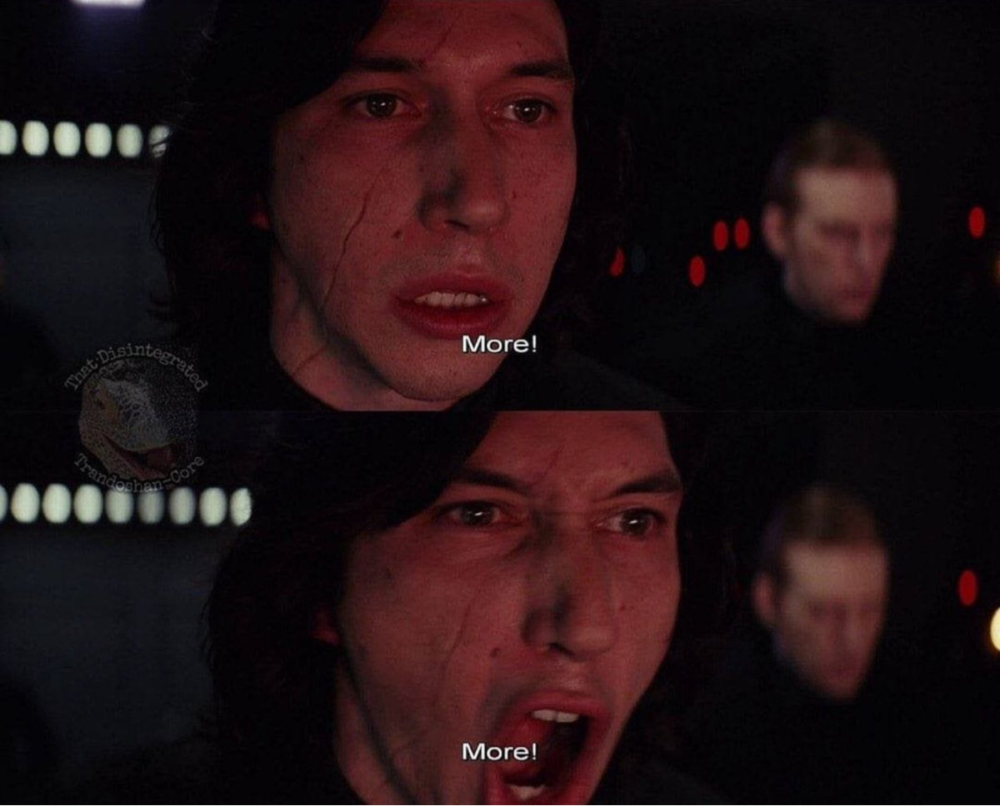

# More Recursion

## Program 1 - Square Root of a Number

The function `sqrt` from the header file `cmath` can be used to find the square root of a nonnegative number. Using Newton's method, you can also write an algorithm to find the square root of a nonnegative real number within a given tolerance as follows: Suppose $x$ is a nonnegative real number, $a$ is the approximate square root of $x$, and $\epsilon$ is the tolerance. Start with $a=x$.

1. If |$a^2-x$| $\leq \epsilon$, then $a$ is the approximate square root of $x$ within the tolerance; otherwise:
2. Replace $a$ with $(a^2 +x)/(2a)$ and repeat Step 1, where $|a^2-x|$ is the absolute value of $a^2-x$.

## Program 2 - Converting a number from decimal (base 10) to binary (base 2) with recursion

Let x be an integer. We call the remainder of x after division by 2 the rightmost bit of x.

Thus, the rightmost bit of 33 is 1 because 33 % 2 is 1, and the rightmost bit of 28 is 0 because 28 % 2 is 0.

We first illustrate the algorithm to convert an integer in base 10 to the equivalent number in binary format, with the help of an example.

Suppose we want to find the binary representation of 35. First, we divide 35 by 2. The quotient is 17, and the remainder—that is, the rightmost bit of 35—is 1. Next, we divide 17 by 2. The quotient is 8, and the remainder—that is, the rightmost bit of 17—is 1. Next, we divide 8 by 2. The quotient is 4, and the remainder—that is, the rightmost bit of 8—is 0. We continue this process until the quotient becomes 0.

The rightmost bit of 35 cannot be printed until we have printed the rightmost bit of 17. The rightmost bit of 17 cannot be printed until we have printed the rightmost bit of 8, and so on. Thus, the binary representation of 35 is the binary representation of 17 (that is, the quotient of 35 after division by 2), followed by the rightmost bit of 35.

Thus, to convert an integer num in base 10 into the equivalent binary number, we first convert the quotient num / 2 into an equivalent binary number and then append the rightmost bit of num to the binary representation of num / 2.

This discussion translates into the following recursive algorithm, in which binary(num) denotes the binary representation of num.

1. binary(num) = num if num = 0
2. binary(num) = binary(num / 2) followed by num % 2 if num > 0.

## Program 3 - Greatest Common Divisor (GCD) of two numbers

Given two integers $x$ and $y$, the following recursive definition determines the greatest common divisor of $x$ and $y$, written as:

$$
\begin{equation*}
\text{gcd}(x, y) =
\begin{cases}
x & \text{if } y = 0 \\
\text{gcd}(y, x \mod y) & \text{if } y \neq 0
\end{cases}
\end{equation*}
$$

Write a recursive function, `gcd`, that takes as parameters two integers and returns the greatest common divisor of the numbers. Also, write a program to test your function.

## Resources

- [Binary to Decimal](res/bin_to_dec.cpp)
- [Largest Element in an Array](res/largest_element.cpp)
