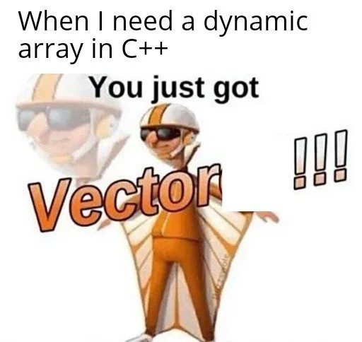

[](https://classroom.github.com/a/Yn0iQD9A)
[](https://classroom.github.com/open-in-codespaces?assignment_repo_id=14935834)
# Vectors in C++



## Introduction

## Program 1 - Comparing Algorithms  

Write a program that created three identical vectors, (`vec1`, `vec2`, `vec3`) and fills them with 10,000 random integers. The program then  sorts `vec1` using bubble sort, `vec2` using selection sort, and `vec3` using `insertionSort`. The program should output the number of comparisons and item assignments made by each sorting algorithm.

```txt
Number of comparisons---
  Bubble sort: 12497500
  Selection sort: 12497500
  Insertion sort: 6153480

Number of item assignments---
  Bubble sort: 18445482
  Selection sort: 14997
  Insertion sort: 6158474
```

## Program 2 - Recursive Binary Search Algorithm

The binary search algorithm that was given earlier is nonrecursive. Write a recursive version of the binary search algorithm and test it on the same data.

```txt
33 found at position: 5
100 is not in the list
```
